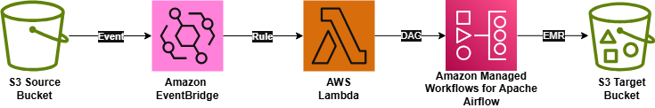
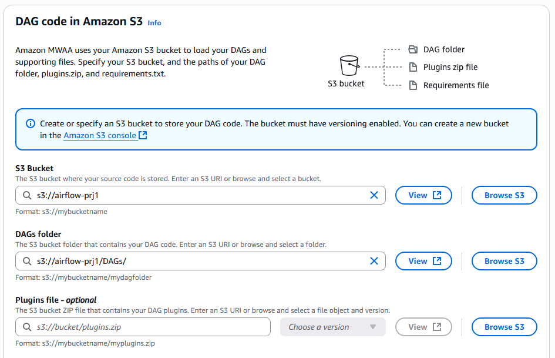
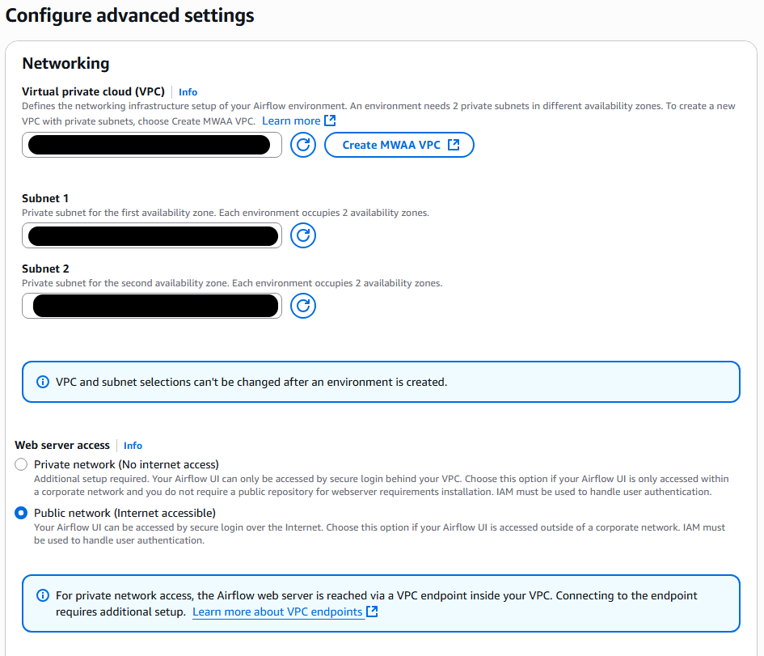
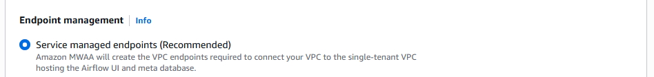
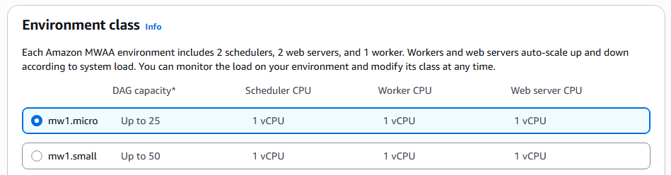
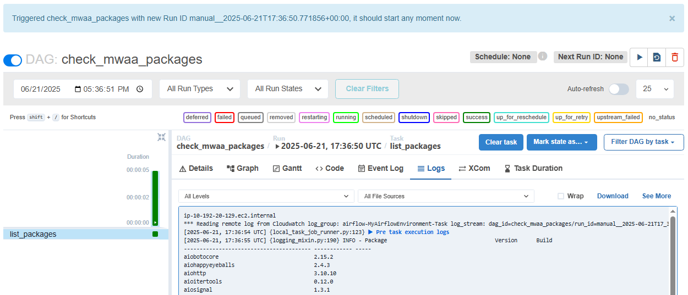
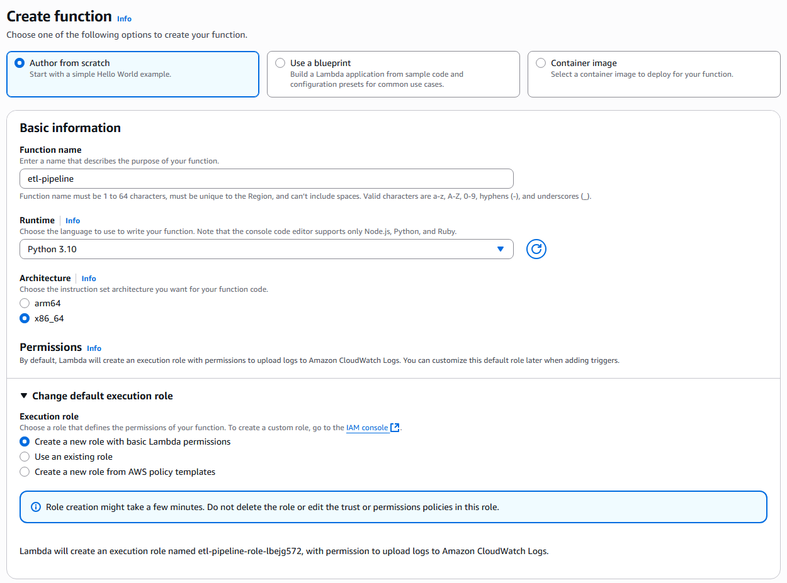
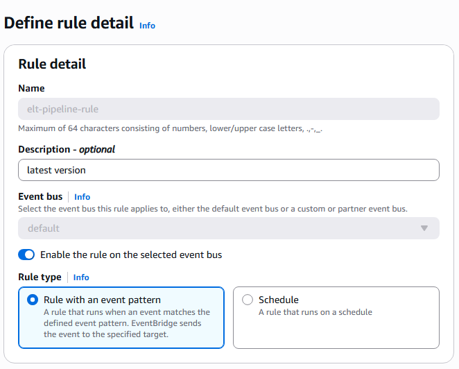
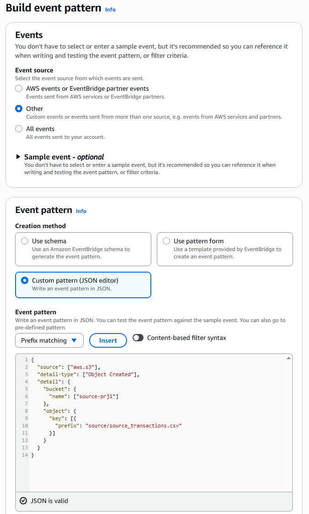

# emr-airflow-data-pipeline
# Serverless ETL Pipeline on AWS (S3 + EventBridge + Lambda + MWAA + EMR)

##  Overview 📖

This project is a serverless, event-driven ETL pipeline built on AWS. It automatically processes incoming data files using Apache Airflow (MWAA), AWS Lambda, and EMR with PySpark. 

> Core Features:  
> - Event-driven architecture  
> - Scalable PySpark jobs on EMR  
> - Fully managed orchestration using MWAA (Airflow)  
> - Automated cleanup to control costs  

The objective of this project is to give you some hands-on practice with ETL orchestration using key AWS services. It is not intended to teach the full data engineering life cycle, best coding standards, Spark, etc. This is a sample of a real-world ETL use case leveraged by multiple enterprise


## Architecture 🗺️ 


## Hardcoded values?! 🤢

Yes. This project is not meant to teach you programming best practices, but rather give you a starting point for your project or simply some guidance if you'd like to get some practice in AWS. Most of the tutorials usually focus on a single service, rather than the orchestration of them. I struggled to get all the services in this ETL pipeline to work together, so I decided to publish everything in hopes this helps someone who’s running into the same issue.

Again, this is not meant to teach you Spark, Python, EMR, etc. This is simply meant to give you a solid example of a basic ETL pipeline using some of AWS’s core services.

**Make it _exist_ first, make it _good_ later**


## ⚠️ This is not a free AWS Tutorial

There is some small cost associated with this project, mostly coming from the VPC that Airflow runs on top of. My monthly AWS bill was around $10.00 USD, but this includes multiple attempts and having my Airflow environment running for days.

MAKE SURE TO CLEAN UP ALL YOUR DEPENDENCIES. Don’t fall for the common gotchas of AWS billing (i.e., VPC dependencies).

#  Tutorial 👨‍🏫

Why is the first step creating the airflow env? why is it public instead of private? Why using the API CMD method? I want to keep the tutorial as lean as possible so please refer to the FAQ sessiong for the reasoning behind these decision. 

##  Setup Airflow environment 🚀

In this section, choose a name for your environment as well as the S3 location for your DAGs. The best practice is to have a dedicated bucket for all your DAGs. For this tutorial, the name of my environment will be `MyAirflowEnvironment`.



Choose a VPC — you can use an existing one, but I recommend creating a new stack. See the `/infra/` directory for the template if needed, or simply click the ***Create MWAA VPC*** button.


**Web server access must be public.**



Endpoint management set to "service managed endpoints"



As far as the enviroment class, the smallest option will be enough for this simple tutorial. 



Create a new permission role for the environment. We’ll be making some changes later on. AWS will automatically set up the permissions needed to access the S3 bucket where the DAGs are located.
(I highly recommend creating new buckets for this — see the FAQ if you want to replicate my bucket setup. The best practice is to have a single bucket for your DAGs, and separate buckets for your EMR source code, source data, and target data.)

Did AWS error out saying your bucket didn’t have the right permissions? Try again. This seems to be a bug.

Once your Airflow environment is up and running, move to the next step.

##  Check Point 🔍

Let’s do a quick sanity check: In the `/DAGs/` folder, there is `module-list.py`. This is a simple DAG that prints out all the Python packages available in the MWAA environment. Drop this code in your DAG folder and run it. This DAG should run successfully — do not continue until this is true.



## Setup Spark application

My PySpark application driver will be sitting on my `codesource-prj1` bucket. The sample code is located at `emr_jobs/data_processing.py`. You can either follow my bucket setup (see FAQ) or follow your own. You will need to update the placeholders.

## Setup DAG

Now, you need to make some updates to `DAGs/data_processing_dag.py`:

`JOB_ROLE_ARN` is the IAM role that EMR Serverless will assume to run your Spark job.
This role basically allows EMR to read and write to the target and source buckets, write to CloudWatch logs, and control the EMR application.

I have provided both JSONs for the role policy and the trust relationship. You will need to re-create these following the samples. See spark_job_policy and trusted_entities under `/permissions/`.

`S3_LOGS_BUCKET` will be the bucket where S3 will write logs and where the data_processing.py file should be located. Best practice is to have two separate buckets for this, but I didn’t want to create more, so I am using the same bucket where my raw CSV is.

Once you have updated the DAG file, add it to your `DAGs/` folder in S3.

By this point, the DAG should be present in your Airflow environment. Go ahead and run it now.

This test run likely failed with an error along the lines of:

```
/AmazonMWAA-airflow is not authorized to perform: emr-serverless:CreateApplication on resource: arn:aws:emr-serverless:us-east
```

This makes sense. Currently, my Airflow permissions are the default created by AWS when I selected "create a new role." This is not enough for this ETL pipeline. On top of the basics, the role needs to:

- Allow access to my `source-proj1` bucket, where the DAG logs will be written
- Allow EMR Serverless operations
- Allow it to pass the `emr_serverless_default_role` to EMR

Model your role after the sample provided in `/permissions/` called `airflow_role_permission`. I won’t go into more details about the permissions, but it is important for you to understand all of these. Ask ChatGPT to break it down for you and give you a better explanation.

By this point, you should be able to successfully run the `data_processing_dag.py` through Airflow. If you're running into issues, debug as needed. Do not move to the next step until the DAG is successful.

## Setup Lambda

If we want to make this ETL an event driven one, we will need a function to by trigger by eventbridge. Let's set up that function.

Go to Lamdba and create the function. Run time should be Python 3.10 at minimum. Creating a default execution role is fine, we will make some changes later.



Once your function is created, model your code after the one provided under `/Lambda/ `

Now, we need to update the permissions for the Lambda function. The role needs to be able to work with Airflow.  Update the permissions of your Lambda function and model it after the sample provided `permissions/lambda_role_permission`

If you want more details about the logic, please see FAQ.

## Setup EventBridge
By this point, the pipeline is almost complete. In order for this to be a true event-driven pipeline, we need to set up an EventBridge rule.

Go to EventBridge and click Create rule.

The default bus is fine, and make sure the rule type is "Rule with an event pattern."



Now, for event pattern. We are basically stating that this rule should be trigger whenever the source_transaction.csv data is uploaded to our source butcket.

Your target should be your Lambda function. 



Once your rule is set in place, upload the data to the target bucket in order to trigger the rule.

# Conclusion

You now have an event-driven ELT pipeline! 

Is it simple? Yes.  
Does it have hard-coded values? Yes  
Can the logic be improved? Yes  
Am I going to do all that? Nope 

As stated multiple times, the goal of this tutorial is to be a simple guide to building an event-driven pipeline. The hardest challenge for any ETL setup is the orchestration of services. Your goal here should be to understand the permissions and methods behind the underlying orchestration.

# FAQ❔ 

1) **What's your bucket setup?**  
There is the main bucket that stores the DAGs. On top of that, I have two separate buckets for the raw data and the clean data. There is also a bucket that stores my PySpark driver code. So I am using four buckets in total.

2) **Why not automate the creation of the Airflow environment to make it truly serverless?** 
You can pretty much automate anything you want in AWS if you try hard enough. The issue is that AWS takes about 30-ish minutes to build the Airflow environment. I suppose you could set up a couple of Lambda functions, one to trigger the Airflow environment creation and another to check on it after 30-ish minutes or so. Buuut, yeah, not doing that.

3) **So, what is the ETL here?**  
We are Extracting the raw data once it lands in S3. Then, we Transform the data using Spark. If you look into the PySpark code, you will see that there is some simple aggregation and data cleanup happening. The code assumes you are using the sample data I provided.

3) **How is Lambda communicating with Airflow, why not using the API?**  
The Airflow API was my first thought too. However, when using the API, you must sign every HTTP request with AWS SigV4. This requires extra code, adds way more complexity to the picture, etc. The CLI token is just more flexible and user-friendly. You can read more about it in the
[AWS Official documentation](https://docs.aws.amazon.com/mwaa/latest/userguide/samples-lambda.html)